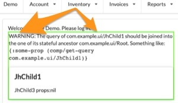

# fulcro-troubleshooting

A development-time library for [Fulcro](https://fulcro.fulcrologic.com/) that helps to detect problems earlier and find and fix their root cause faster.

For additional help, see the [Fulcro Troubleshooting Decision Tree](https://blog.jakubholy.net/2020/troubleshooting-fulcro/).

## Rationaly

Fulcro does an awesome job of checking your code and providing helpful messages but it is inherently limited by the fact that most of its checks are compile-time. `fulcro-troubleshooting` checks your application at run time and thus has much more insight into what is really going on. It also integrates with the UI so that you see the errors and warnings right in the UI, next to the place where you observe the problem.

## What can it do?

### Proper query inclusion

Warn you when a component's query is not included in its parent's:



### Valid idents

Warn when there is something fishy about the component's ident:


### Presence of child data

Warn when there is no data for a child, perhaps because the data has failed to load, or is at the wrong place of the DB, or because you have not provided `:initial-state` for the component (which is optional but crucial e.g. for Link Query - only components):


**TODO**: Handle ident and link queries.

Experimental configuration (subject to change):

```clojure
(set! holyjak.fulcro-troubleshooting/*config*
      ;; return truthy for any join prop that should be check for having non-nil data in the props:
      {:join-prop-filter (fn [_ prop] (not= prop :jh/address))})
```

## Status

This is very alpha, under active development. However it is already useful. So do not hesitate to try it out!

Get in touch with `@holyjak` in the `#fulcro` channel of the Clojurians Slack if you have any questions or comments.

## Usage

Add the library to your project:

```clojure
;; deps.edn
:aliases
{:dev {:extra-deps {holyjak/fulcro-troubleshooting
                    {:git/url "https://github.com/holyjak/fulcro-troubleshooting"
                     ;; run `clojure -X:deps git-resolve-tags` to insert the correct :sha
                     :tag "latest"}}}
```

and make sure that the `:dev` alias is activated and the library's names is automatically required:

```clojure
;; shadow-cljs.edn
{:deps {:aliases [:dev]}
 :builds {:main {:devtools {:preloads [holyjak.fulcro-troubleshooting ...] ...}
                 ...}}}
```

(Assuming you have activated the `dev` alias in your `shadow-cljs.edn`.)

When you create your Fulcro/RAD app, add the middleware provided by the library:

```clojure
(ns my.app
  (:require
    ;; [holyjak.fulcro-troubleshooting] ; add if you haven't added it as :preload
    [com.fulcrologic.fulcro.application :as app]))

(defonce app (app/fulcro-app {:render-middleware 
                              (when goog.DEBUG js/holyjak.fulcro_troubleshooting.troubleshooting_render_middleware)}))
;; we use js/.. instead of holyjak.fulcro-troubleshooting/troubleshooting-render-middleware so that
;; the code will still compile for prod release, when the lib is not included
```

## License

Copyleft 2021 Holyjak

Distributed under the Unlicense, see http://unlicense.org/.
