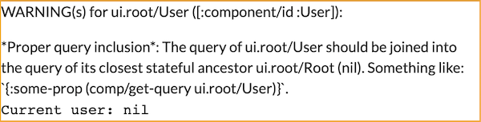
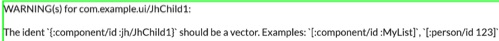
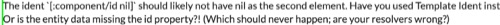
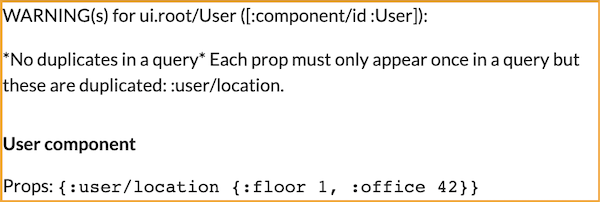

# fulcro-troubleshooting

A development-time library for [Fulcro](https://fulcro.fulcrologic.com/) that helps to detect problems earlier and find and fix their root cause faster.

For additional help, see the [Fulcro Troubleshooting Decision Tree](https://blog.jakubholy.net/2020/troubleshooting-fulcro/).

## Rationale

Fulcro does an awesome job of checking your code and providing helpful messages but it is inherently limited by the fact that most of its checks are compile-time. `fulcro-troubleshooting` checks your application at run time and thus has much more insight into what is really going on. It also integrates with the UI so that you see the errors and warnings right in the UI, next to the place where you observe the problem.

## What can it do?

### Check: Proper query inclusion

Warn you when a component's query is not included in its parent's:



Experimental configuration (subject to change):

```clojure
(set! holyjak.fulcro-troubleshooting/*config*
      ;; return truthy to check the inclusion of the component's query in an ancestor
      {:query-inclusion-filter (fn [component-instance comp-class] 
                                 (not= comp-class :com.example.ui/MyComponent))})
;; OR: (when goog.DEBUG (set! js/holyjak.fulcro_troubleshooting._STAR_config_STAR_ {..}))
```
### Check: Valid idents

Warn when there is something fishy about the component's ident:




### Check: Presence of child data

Warn when there is no data for a child, perhaps because the data has failed to load, or is at the wrong place of the DB, or because you have not provided `:initial-state` for the component (which is optional but crucial e.g. for Link Query - only components):


Experimental configuration (subject to change):

```clojure
(set! holyjak.fulcro-troubleshooting/*config*
      ;; return truthy for any join prop that should be checked for having non-nil data in the props:
      {:join-prop-filter (fn [component-instance prop] (not= prop :jh/address))})
;; OR: (when goog.DEBUG (set! js/holyjak.fulcro_troubleshooting._STAR_config_STAR_ {..}))
```

You can also get rid of this warning by using `:initial-state` and setting it to something non-nil such as `[]` for a list or `{}` for a map. (Though remember that in the Template Form `{}` means "include initial state from the child" so, if there is a child element for that prop, set also its initial state. And remember to propagate the initial state up all the way to the root component.)

### Check: Valid :initial-state

Ideally, you would use the [template form](https://book.fulcrologic.com/#_template_mode) of `:initial-state` as it checks that you only include props that you query for.

This check controls that you actually return either nil or a map and that the map has no key
you do not query for (contrary to the template form check, this works also for the lambda form,
though it is less powerful).

Experimental configuration (subject to change):

```clojure
(set! holyjak.fulcro-troubleshooting/*config*
      ;; return truthy for any initial state key that should be checked for having being in the query:
      {:initial-state-filter (fn [component-instance prop] (not= prop :jh/address))})
;; OR: (when goog.DEBUG (set! js/holyjak.fulcro_troubleshooting._STAR_config_STAR_ {..}))
```

### Check: No duplicates in a query

Warn when the same property is used repeatedly in a query (ignoring the content of sub-queries). 
Duplicates don't make sense, since a property can only be included once in the props map anyway.
It can cause unexpected behavior, in the least all but one of the occurrences being ignored.

Example:

```clojure
(defsc User [_ props]
  {:query [{:user/location (comp/get-query Location)} :user/name #_... :user/location]
   :ident (fn [] [:component/id :User])}
   ...)
```



### User components get wrapped with [React Error Boundary](https://book.fulcrologic.com/#_react_errors)

Non-Fulcro components are wrapped with an Error Boundary so that if their render throws an exception, it is caught and displayed in the UI, instead of taking the whole page down.

## Status

Mature. Bugs are fixed, pull requests reviewed, and feature requests considered.

Get in touch with `@holyjak` in the `#fulcro` channel of the Clojurians Slack if you have any questions, problems, ideas, or comments.

## Usage

You need to do three things:

(1) Add the library to your project:

```clojure
;; deps.edn
:aliases
{:dev {:extra-deps {holyjak/fulcro-troubleshooting
                    {:git/url "https://github.com/holyjak/fulcro-troubleshooting"
                     ;; BEWARE: run `clojure -X:deps git-resolve-tags` to insert the correct :sha
                     :sha "2bf48d7897e9f36323d5bb6b806c3a605b0fc0a0" :tag "latest"
                     }}}
```

(2) Make sure that the `:dev` alias is activated and the library's namespace is automatically required:

```clojure
;; shadow-cljs.edn
{:deps {:aliases [:dev]} ; <-- this
 :builds {:main {:devtools {:preloads [holyjak.fulcro-troubleshooting ...] ...} ; <-- and this
                 ...}}}
```


(3) When you create your Fulcro/RAD app, add the middleware provided by the library:

```clojure
(ns my.app
  (:require
    ;; [holyjak.fulcro-troubleshooting] ; add if you haven't added it as :preload
    [com.fulcrologic.fulcro.application :as app]))

(defonce app (app/fulcro-app {:render-middleware 
                              (when goog.DEBUG js/holyjak.fulcro_troubleshooting.troubleshooting_render_middleware)}))
;; we use js/.. instead of holyjak.fulcro-troubleshooting/troubleshooting-render-middleware so that
;; the code will still compile for prod release, when the lib is not included
```

## Feature ideas

- check initial state (if present) to be a map with keys <= query keys

## License

Copyleft 2021 Jakub Holý

Distributed under the Unlicense, see http://unlicense.org/.
